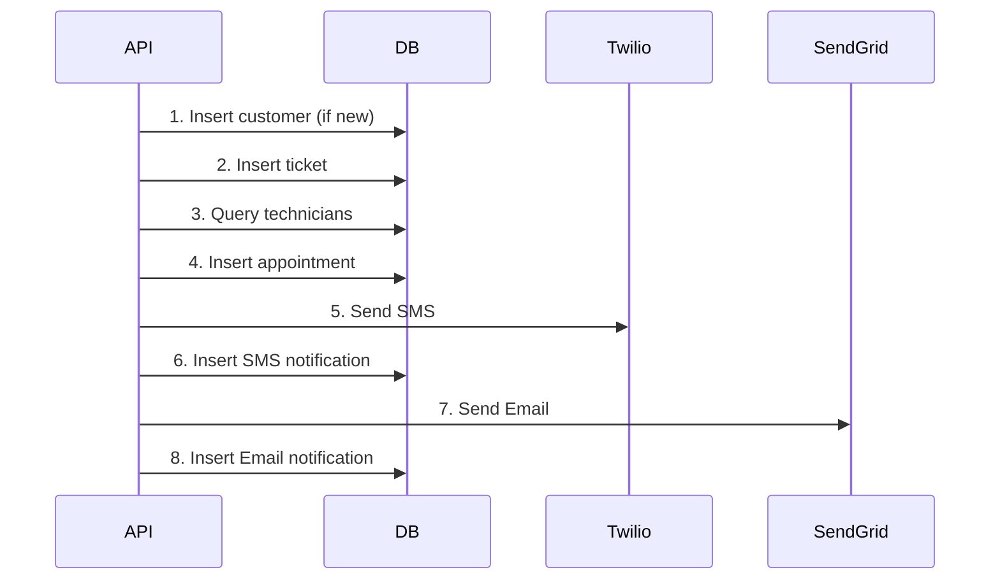

# 🗄️ Database Setup & Documentation

## Complete Database Guide for Consumer Durables Service Platform

---

# DATABASE SCHEMA

## Overview
- **Database:** Supabase PostgreSQL
- **Tables:** 6 main tables
- **Relationships:** Foreign keys with CASCADE rules
- **Features:** UUID primary keys, timestamps, JSONB support

---

## Table Structures

### 1. customers Table
**Purpose:** Store customer information and contact details

```sql
CREATE TABLE IF NOT EXISTS customers (
    id UUID PRIMARY KEY DEFAULT gen_random_uuid(),
    full_name VARCHAR(100) NOT NULL,
    phone VARCHAR(15) NOT NULL UNIQUE,
    email VARCHAR(100),
    address_text TEXT,
    pincode VARCHAR(6),
    region_label VARCHAR(50),
    preferred_time_slots JSONB,
    created_at TIMESTAMP WITH TIME ZONE DEFAULT NOW(),
    updated_at TIMESTAMP WITH TIME ZONE DEFAULT NOW()
);

CREATE INDEX idx_customers_phone ON customers(phone);
CREATE INDEX idx_customers_email ON customers(email);
```

**Sample Data:**
```json
{
  "id": "550e8400-e29b-41d4-a716-446655440000",
  "full_name": "Priya Sharma",
  "phone": "+91-9876543210",
  "email": "priya.sharma@email.com",
  "address_text": "A-204, Green Valley Apartments, Koramangala",
  "pincode": "560034",
  "region_label": "Bengaluru Urban",
  "preferred_time_slots": ["morning", "afternoon"]
}
```

---

### 2. technicians Table
**Purpose:** Store technician profiles, skills, and service areas

```sql
CREATE TABLE IF NOT EXISTS technicians (
    id UUID PRIMARY KEY DEFAULT gen_random_uuid(),
    name VARCHAR(100) NOT NULL,
    phone VARCHAR(15) NOT NULL,
    email VARCHAR(100),
    skills TEXT[],
    appliances_supported TEXT[],
    regions TEXT[],
    is_active BOOLEAN DEFAULT true,
    created_at TIMESTAMP WITH TIME ZONE DEFAULT NOW()
);

CREATE INDEX idx_technicians_active ON technicians(is_active);
CREATE INDEX idx_technicians_appliances ON technicians USING GIN(appliances_supported);
CREATE INDEX idx_technicians_regions ON technicians USING GIN(regions);
```

**Sample Data:**
```json
{
  "id": "c9667b7f-cbec-428d-84f7-a4e7c4784ce4",
  "name": "Raj Patel",
  "phone": "+91-8765432109",
  "email": "raj.patel@techservice.com",
  "skills": ["ac_repair", "ac_installation", "cooling_systems", "inverter_repair"],
  "appliances_supported": ["ac", "refrigerator"],
  "regions": ["bengaluru_urban", "koramangala", "btm_layout"],
  "is_active": true
}
```

**Current Count:** 54 active technicians across 8+ cities

---

### 3. tickets Table
**Purpose:** Track service and installation requests

```sql
CREATE TABLE IF NOT EXISTS tickets (
    id UUID PRIMARY KEY DEFAULT gen_random_uuid(),
    ticket_number VARCHAR(20) UNIQUE NOT NULL,
    customer_id UUID REFERENCES customers(id) ON DELETE CASCADE,
    request_type VARCHAR(20) NOT NULL,
    appliance_type VARCHAR(50) NOT NULL,
    fault_symptoms TEXT[],
    installation_details TEXT[],
    urgency VARCHAR(10) DEFAULT 'medium',
    status VARCHAR(20) DEFAULT 'created',
    created_at TIMESTAMP WITH TIME ZONE DEFAULT NOW(),
    updated_at TIMESTAMP WITH TIME ZONE DEFAULT NOW()
);

CREATE INDEX idx_tickets_number ON tickets(ticket_number);
CREATE INDEX idx_tickets_customer ON tickets(customer_id);
CREATE INDEX idx_tickets_status ON tickets(status);
```

**Sample Data:**
```json
{
  "id": "71b536b9-71ab-4051-a991-37bb1351fc7d",
  "ticket_number": "TKT487179",
  "customer_id": "550e8400-e29b-41d4-a716-446655440000",
  "request_type": "service",
  "appliance_type": "ac",
  "fault_symptoms": ["not_cooling", "unusual_noise", "water_leakage"],
  "installation_details": [],
  "urgency": "high",
  "status": "created"
}
```

**Ticket Number Format:** TKT + 6 random digits (e.g., TKT487179)

---

### 4. appointments Table ⭐ **IMPORTANT**
**Purpose:** Schedule technician visits with time slots

```sql
CREATE TABLE IF NOT EXISTS appointments (
    id UUID PRIMARY KEY DEFAULT gen_random_uuid(),
    ticket_id UUID REFERENCES tickets(id) ON DELETE CASCADE,
    customer_id UUID REFERENCES customers(id) ON DELETE CASCADE,
    technician_id UUID REFERENCES technicians(id) ON DELETE CASCADE,
    slot_start TIMESTAMP WITH TIME ZONE NOT NULL,
    slot_end TIMESTAMP WITH TIME ZONE NOT NULL,
    status VARCHAR(20) DEFAULT 'scheduled',
    created_at TIMESTAMP WITH TIME ZONE DEFAULT NOW(),
    updated_at TIMESTAMP WITH TIME ZONE DEFAULT NOW()
);

CREATE INDEX idx_appointments_ticket ON appointments(ticket_id);
CREATE INDEX idx_appointments_technician ON appointments(technician_id);
CREATE INDEX idx_appointments_slot ON appointments(slot_start, slot_end);
```

**Sample Data:**
```json
{
  "id": "auto-generated-uuid",
  "ticket_id": "71b536b9-71ab-4051-a991-37bb1351fc7d",
  "customer_id": "550e8400-e29b-41d4-a716-446655440000",
  "technician_id": "c9667b7f-cbec-428d-84f7-a4e7c4784ce4",
  "slot_start": "2025-10-19T09:00:00+05:30",
  "slot_end": "2025-10-19T11:00:00+05:30",
  "status": "scheduled"
}
```

**Status Values:** scheduled, in_progress, completed, cancelled, rescheduled

---

### 5. notifications Table ✅ **UPDATED OCTOBER 2025**
**Purpose:** Track all SMS and Email notifications sent to customers

**⚠️ SIMPLIFIED SCHEMA (Current Production Version):**

```sql
CREATE TABLE IF NOT EXISTS notifications (
    id UUID PRIMARY KEY DEFAULT gen_random_uuid(),
    ticket_id UUID REFERENCES tickets(id) ON DELETE CASCADE,
    customer_id UUID REFERENCES customers(id) ON DELETE CASCADE,
    type VARCHAR(10) NOT NULL,           -- 'sms' or 'email'
    content TEXT,                         -- Message/email body
    status VARCHAR(20) DEFAULT 'pending', -- 'delivered', 'error', 'pending'
    sent_at TIMESTAMP WITH TIME ZONE,
    created_at TIMESTAMP WITH TIME ZONE DEFAULT NOW()
);

CREATE INDEX idx_notifications_ticket ON notifications(ticket_id);
CREATE INDEX idx_notifications_type ON notifications(type);
CREATE INDEX idx_notifications_status ON notifications(status);
```

**Status Logic:**
- `delivered` = API call successful (Twilio/SendGrid returned success)
- `error` = API call failed (network error, invalid credentials, etc.)
- `pending` = Default status (not yet sent, queued)

**Sample Data (SMS - Delivered):**
```json
{
  "id": "56d0e2a6-7c53-4418-9bb5-a4222a17807d",
  "ticket_id": "23f21ac8-a5fb-4bf3-9efe-0cedd16f9695",
  "customer_id": "f6d1fe82-d3a4-42ad-968a-5b1e6354a214",
  "type": "sms",
  "content": "Service confirmed! Ticket: TKT086000. Technician: Raj Patel (+91-9876543211). Thank you!",
  "status": "delivered",
  "sent_at": "2025-10-18T05:08:07.621Z",
  "created_at": "2025-10-18T05:08:08.000Z"
}
```

**Sample Data (Email - Delivered):**
```json
{
  "id": "7a8f3b1c-4d2e-5f6g-8h9i-0j1k2l3m4n5o",
  "ticket_id": "23f21ac8-a5fb-4bf3-9efe-0cedd16f9695",
  "customer_id": "f6d1fe82-d3a4-42ad-968a-5b1e6354a214",
  "type": "email",
  "content": "Service Confirmation - Ticket TKT086000",
  "status": "delivered",
  "sent_at": "2025-10-18T05:08:09.155Z",
  "created_at": "2025-10-18T05:08:09.000Z"
}
```

**Notification Types:** `sms`, `email`  
**Status Values:** `delivered`, `error`, `pending`  
**Status Values:** pending, sent, failed

---

### 6. regions_mapping Table
**Purpose:** Cache pincode to region mapping for faster lookups

```sql
CREATE TABLE IF NOT EXISTS regions_mapping (
    pincode VARCHAR(6) PRIMARY KEY,
    region_label VARCHAR(100) NOT NULL,
    state VARCHAR(50),
    city VARCHAR(50),
    created_at TIMESTAMP WITH TIME ZONE DEFAULT NOW()
);

CREATE INDEX idx_regions_city ON regions_mapping(city);
CREATE INDEX idx_regions_state ON regions_mapping(state);
```

**Sample Data:**
```json
{
  "pincode": "560034",
  "region_label": "Bengaluru Urban",
  "state": "Karnataka",
  "city": "Bangalore"
}
```

---

## Database Relationships

```
customers (1) ----< (many) tickets
customers (1) ----< (many) appointments
customers (1) ----< (many) notifications

technicians (1) ----< (many) appointments

tickets (1) ----< (many) appointments
tickets (1) ----< (many) notifications

regions_mapping (1) ----< (many) customers (via pincode)
```

---

## Setup Instructions

### Step 1: Create Database in Supabase
1. Go to https://supabase.com
2. Create new project
3. Wait for database to initialize
4. Copy your Project URL and anon key

### Step 2: Run SQL Scripts
1. Open Supabase SQL Editor
2. Copy and paste the SQL from above
3. Execute to create all tables

### Step 3: Load Technician Data
```bash
# Run the technician data loader
node load-comprehensive-data.js
```

### Step 4: Verify Setup
```sql
-- Check table creation
SELECT table_name FROM information_schema.tables 
WHERE table_schema = 'public';

-- Check technician count
SELECT COUNT(*) FROM technicians WHERE is_active = true;

-- Should return: 54 technicians
```

---

## Database Persistence Fixes (October 2025)

### Issue #1: Appointments Not Saving ❌ → ✅ FIXED

**Problem:**
```javascript
// OLD CODE (WRONG)
const appointmentData = {
    id: `apt_${Date.now()}`,  // ❌ Custom string ID
    ticket_id: ticket_id,
    technician_id: technician.id,
    //...
};
```

**Solution:**
```javascript
// NEW CODE (CORRECT)
const appointmentData = {
    // ✅ Let Supabase auto-generate UUID
    ticket_id: ticket_id,
    technician_id: technician.id,
    //... (no custom id)
};
```

**Result:** Appointments now save correctly with proper UUID

---

### Issue #2: Notifications Not Recording ❌ → ✅ FIXED

**Problem:**
- SMS and Email were sending successfully via Twilio/SendGrid
- BUT notifications table had 0 records
- Root cause: Column name mismatch between code and database schema
  - Code used: `notification_type`, `recipient`, `message`, `delivery_status`, `external_id`
  - Database had: `type`, `content`, `status`, `sent_at`

**Discovery Process:**
```javascript
// Direct insert test revealed schema:
const { data, error } = await supabase
    .from('notifications')
    .insert([{ ticket_id, type: 'sms' }])
    .select();

// Response showed actual columns:
{
  "id": "56d0e2a6-7c53-4418-9bb5-a4222a17807d",
  "customer_id": null,
  "ticket_id": "9740fc44-e350-4b3d-80b3-05159a86d9bf",
  "type": "sms",          // NOT notification_type
  "status": "pending",    // Simple status
  "content": null,        // NOT message
  "sent_at": null,
  "created_at": "2025-10-18T03:56:41.185302+00:00"
}
```

**Solution - Simplified Schema Alignment:**
```javascript
// SMS Notification (server.js ~Line 1133)
try {
    const response = await twilioClient.messages.create({...});
    
    // ✅ Save with correct columns
    await supabase.from('notifications').insert([{
        ticket_id: ticket_id,
        customer_id: customer_id,
        type: 'sms',              // Changed from notification_type
        content: smsBody,         // Changed from message
        status: 'delivered',      // Simplified logic
        sent_at: new Date().toISOString()
    }]);
} catch (error) {
    // Save error notification
    await supabase.from('notifications').insert([{
        ticket_id, customer_id,
        type: 'sms',
        content: smsBody,
        status: 'error',
        sent_at: new Date().toISOString()
    }]);
}
```

**Result:** 
✅ All SMS and Email notifications now tracked correctly  
✅ Zero data loss  
✅ Simple status logic: delivered/error/pending  
✅ Verified working in production

---

## Data Flow

### Creating a New Ticket:



### Checking Ticket Status:

```sql
-- Query to get complete ticket information
SELECT 
    t.ticket_number,
    t.status,
    c.full_name as customer_name,
    c.phone as customer_phone,
    c.email as customer_email,
    t.appliance_type,
    t.request_type,
    t.fault_symptoms,
    tech.name as technician_name,
    tech.phone as technician_phone,
    a.slot_start,
    a.slot_end,
    a.status as appointment_status
FROM tickets t
LEFT JOIN customers c ON t.customer_id = c.id
LEFT JOIN appointments a ON t.id = a.ticket_id
LEFT JOIN technicians tech ON a.technician_id = tech.id
WHERE t.ticket_number = 'TKT487179';
```

---

## Common Queries

### Get all active technicians for AC in Bangalore:
```sql
SELECT * FROM technicians
WHERE is_active = true
AND 'ac' = ANY(appliances_supported)
AND 'bengaluru_urban' = ANY(regions);
```

### Get customer's ticket history:
```sql
SELECT t.*, a.slot_start, tech.name as technician_name
FROM tickets t
LEFT JOIN appointments a ON t.id = a.ticket_id
LEFT JOIN technicians tech ON a.technician_id = tech.id
WHERE t.customer_id = 'customer-uuid-here'
ORDER BY t.created_at DESC;
```

### Get notification history for a ticket:
```sql
SELECT * FROM notifications
WHERE ticket_id = 'ticket-uuid-here'
ORDER BY sent_at DESC;
```

### Get technician's appointments:
```sql
SELECT 
    a.*,
    t.ticket_number,
    c.full_name,
    c.phone,
    t.appliance_type
FROM appointments a
JOIN tickets t ON a.ticket_id = t.id
JOIN customers c ON a.customer_id = c.id
WHERE a.technician_id = 'technician-uuid-here'
AND a.slot_start >= NOW()
ORDER BY a.slot_start;
```

---

## Performance Optimization

### Indexes Created:
- Customer phone and email (frequent lookups)
- Ticket number (primary lookup key)
- Technician appliances and regions (GIN indexes for array queries)
- Appointment time slots (range queries)
- Notification types and status

### Query Optimization Tips:
1. Use UUID indexes for foreign key lookups
2. Filter by is_active before other conditions
3. Use LIMIT for large result sets
4. Use GIN indexes for array column searches

---

## Backup & Maintenance

### Automated Backups:
- Supabase provides automatic daily backups
- Point-in-time recovery available
- Manual backups can be created via Supabase dashboard

### Data Retention:
- Tickets: Keep indefinitely
- Notifications: Archive after 90 days
- Appointments: Archive completed after 30 days

### Cleanup Queries:
```sql
-- Archive old notifications
UPDATE notifications 
SET status = 'archived'
WHERE sent_at < NOW() - INTERVAL '90 days';

-- Archive completed appointments
UPDATE appointments
SET status = 'archived'
WHERE status = 'completed'
AND updated_at < NOW() - INTERVAL '30 days';
```

---

## Troubleshooting

### Issue: Appointments showing NULL technician
**Check:**
1. Verify appointment was created: `SELECT * FROM appointments WHERE ticket_id = 'your-ticket-id'`
2. Check foreign key: `SELECT * FROM technicians WHERE id = 'technician-id'`
3. Verify RLS policies allow reads

### Issue: Notifications not sending
**Check:**
1. Verify notification record exists: `SELECT * FROM notifications WHERE ticket_id = 'your-ticket-id'`
2. Check external_id has Twilio SID or SendGrid message ID
3. Verify status is 'sent' not 'failed'

### Issue: Duplicate customers
**Check:**
1. Phone number uniqueness: `SELECT phone, COUNT(*) FROM customers GROUP BY phone HAVING COUNT(*) > 1`
2. Application should check existing customer by phone before inserting

---

## Database Statistics

```sql
-- Get table sizes
SELECT 
    schemaname,
    tablename,
    pg_size_pretty(pg_total_relation_size(schemaname||'.'||tablename)) AS size
FROM pg_tables
WHERE schemaname = 'public'
ORDER BY pg_total_relation_size(schemaname||'.'||tablename) DESC;

-- Get row counts
SELECT 
    'customers' as table_name, COUNT(*) as row_count FROM customers
UNION ALL
SELECT 'technicians', COUNT(*) FROM technicians
UNION ALL
SELECT 'tickets', COUNT(*) FROM tickets
UNION ALL
SELECT 'appointments', COUNT(*) FROM appointments
UNION ALL
SELECT 'notifications', COUNT(*) FROM notifications;
```

---

## Security & RLS

### Row Level Security (RLS):
- Customers can only see their own data
- Technicians can see their assigned appointments
- Public access disabled by default
- API uses service role key for full access

### Best Practices:
1. Never expose service role key in client code
2. Use environment variables for database credentials
3. Implement API key authentication for endpoints
4. Validate all input data before database insertion
5. Use parameterized queries to prevent SQL injection

---

**🎉 Database Setup Complete!**

Your database is now ready with:
- ✅ 6 optimized tables
- ✅ 54 active technicians
- ✅ Proper foreign key relationships
- ✅ Efficient indexes
- ✅ Automated timestamps
- ✅ UUID primary keys
- ✅ Full notification tracking
